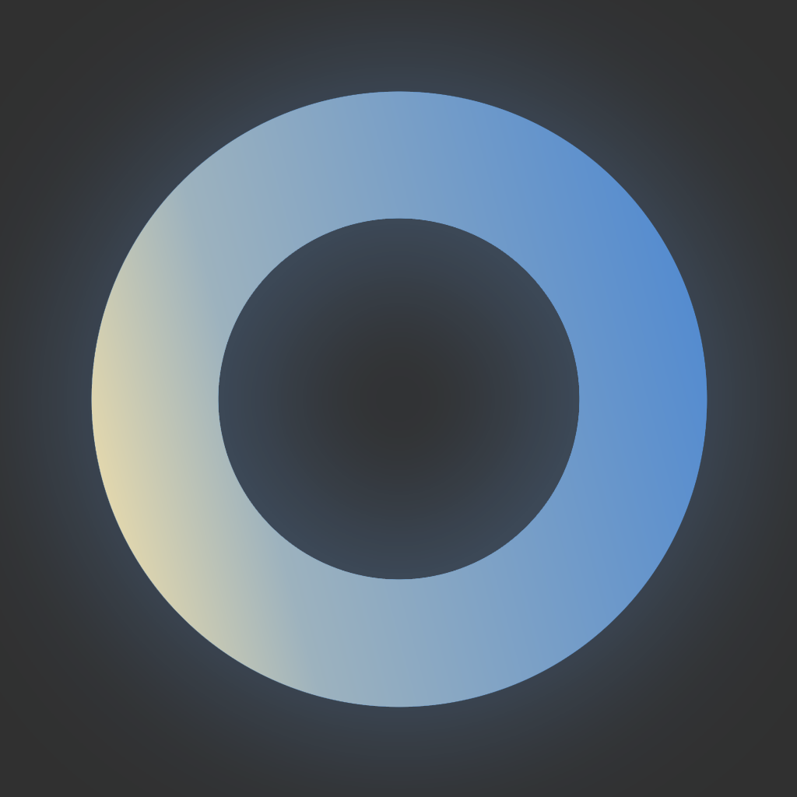
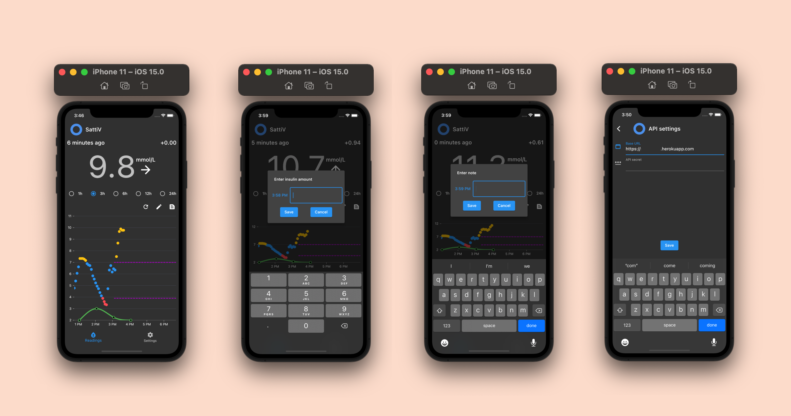

# SattiV

## About the app

SattiV is a client for [Nightscout](http://nightscout.github.io), an open-source cloud based CGM.
It is intended that people suffering from diabetes will be able to visualize readings from their
sensors. The principal difference of the app is its compatibility for both iOS and Android devices
that is made possible by the [Flutter](https://flutter.dev) programming language.

This is a work in progress, therefore, it may lack some functionality that is present in
[xDrip](https://github.com/NightscoutFoundation/xDrip), zDrip, or
[Shuggah](https://apps.apple.com/sa/app/shuggah/id1586789452). For example, there is still no
"master" mode, only "follower" mode. However, unlike other iOS clients, SattiV has xDrip-like
functionality of  adding and visualizing treatments (notes and insulin injections).

### Features
* Nightscout follower mode
* Real-time monitoring of blood glucose
* Adding/undoing treatments (bolus, notes)

## For developers
### Done
* MVVM architecture
* (Multi-) Provider state management
* Calibrations, Readings, and Treatments management

### To do
* Error/Exception management
* Add notifications and sounds
* Be smarter about data usage (right now all entries are queried from API, no local storage)
* Add "master" mode (aka Bluetooth connection)
* Add forecasts (probably linear or low order polynomials should do fine)

### Compatibility

The app can be installed to more or less all iOS 10+ versions, later down the road I will try to make
that range as broad as possible. Also, a broad range of Android devices will be able to run the app
(except probably super old ones).

To run iOS app you will need XCode that is compatible with this project, and/or Android Studio. For
Android devices only Android Studio should do the trick.

After finishing first MVP I plan to publish it to the TestFlight and subsequently to the AppStore (Maybe Google Play too). 

For help getting started with Flutter, view
[online documentation](https://flutter.dev/docs), which offers tutorials,
samples, guidance on mobile development, and a full API reference.
